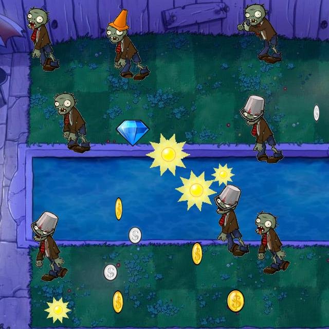
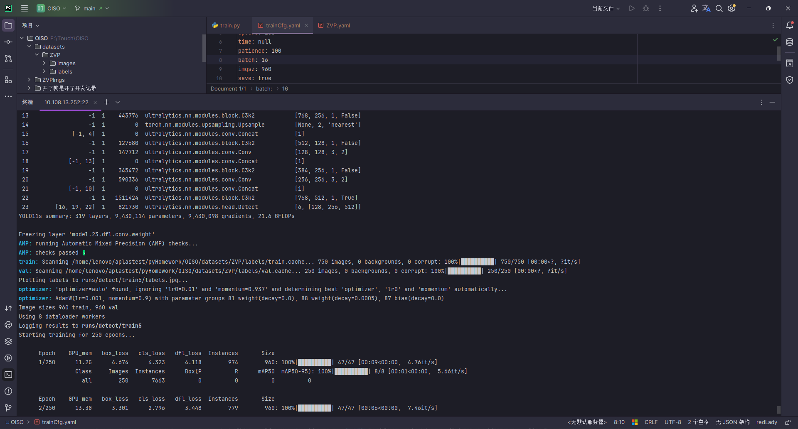
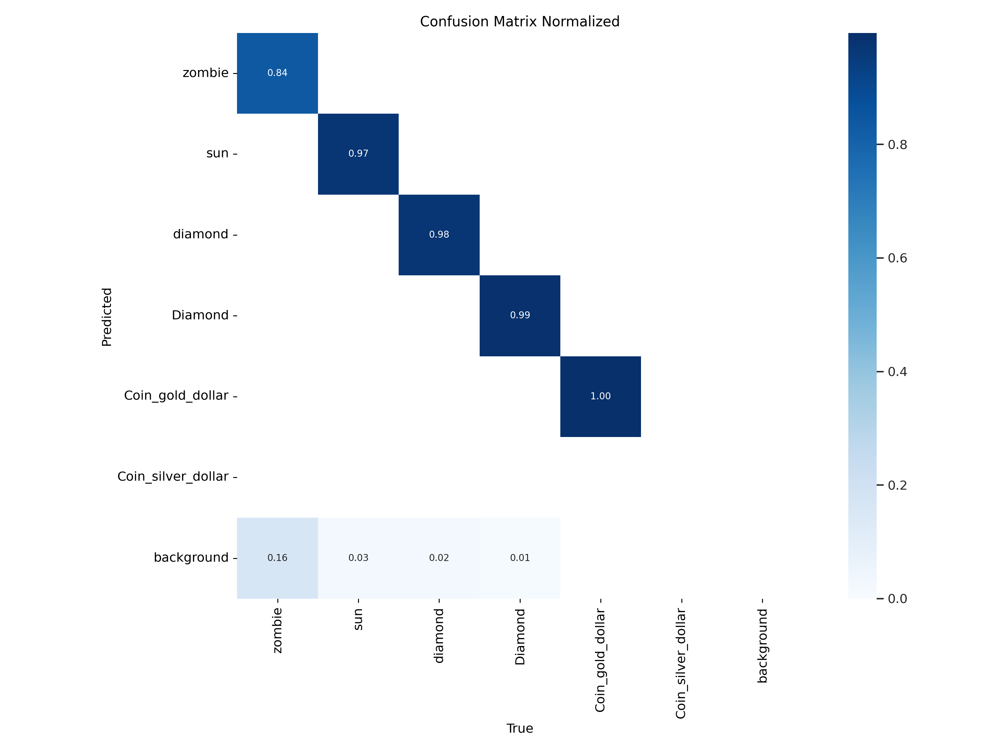
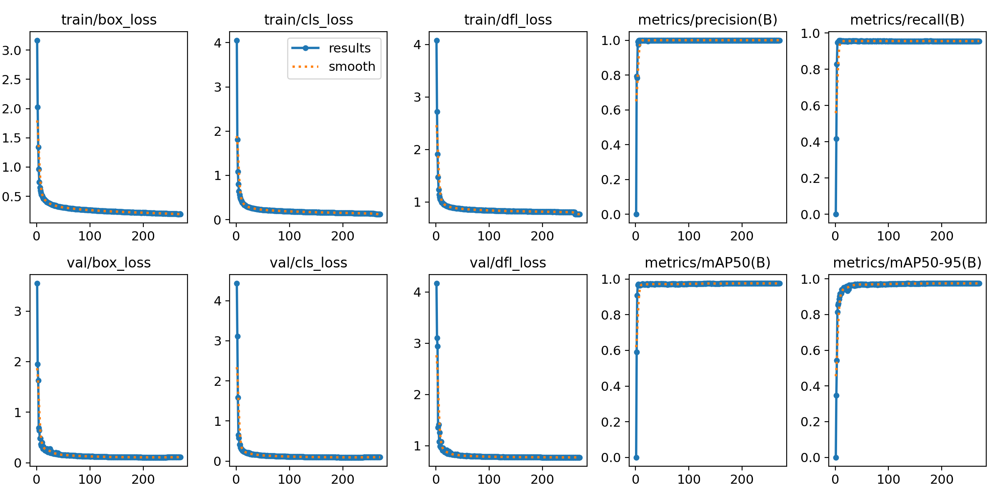
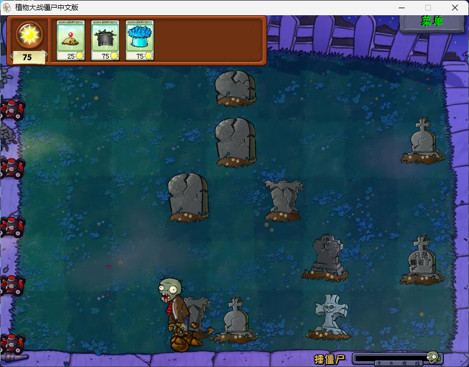
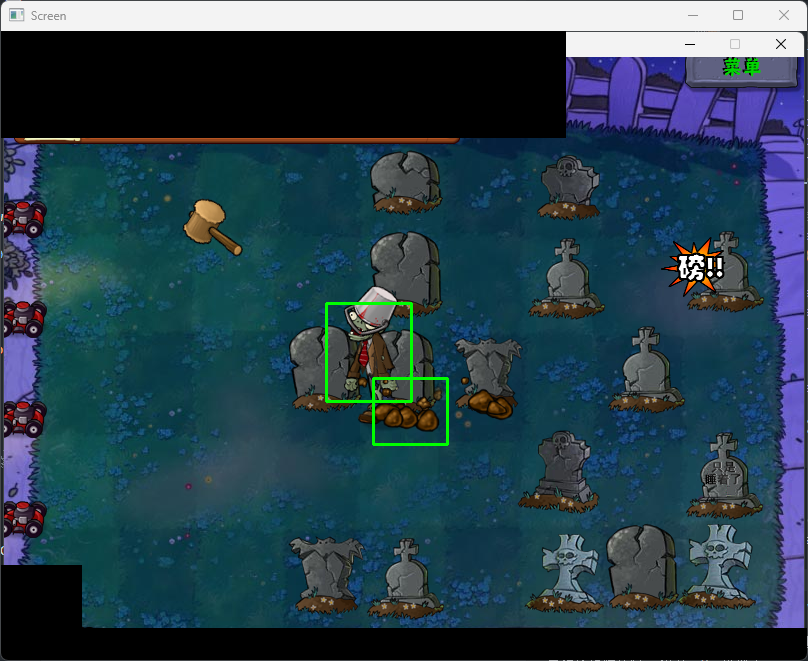
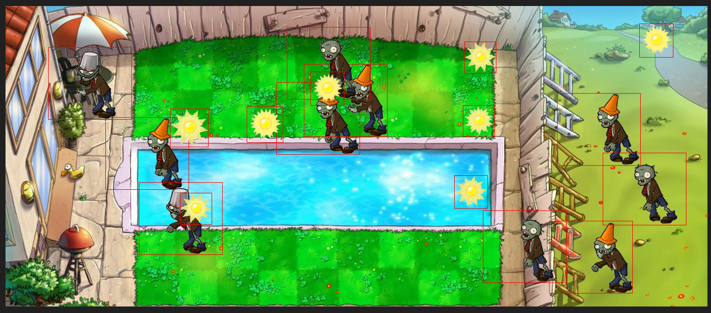

# 开了就是开了/OPEN is OPEN

## 简介

本项目设计之初是为了解决植物大战僵尸的打地鼠关卡的，因为有些人手速不够快，因此我们制作了该脚本来帮助他们通关，该项目基于`ultralytics`，`PIL`，`OpenCV`，`PyautoGUI`等开源库作为框架，具有自动打植物大战僵尸打地鼠关卡功能，并且提供了一个自动化生成数据集的脚本。

视频演示：**[[python大作业]开了就是开了？终版展示](https://www.bilibili.com/video/BV1dGB7YGEzE/)**

快快进去三连:point_up::smirk:

## 程序源文件目录及说明

```yaml
.
├── 1.0汉化第二版图鉴加强    # 本项目使用的植物大战僵尸版本
├── models                 # 存放文件的目录
├── datasets               # 存放ZVP数据集的目录
├── ZVPImgs                # 存放生成数据集原图片的目录
├── configs                # 存放配置文件的目录
│   ├── trainCfg.yaml      # 训练配置文件
│   └── ZVP.yaml           # 数据集配置文件
├── utils                  # 组件文件夹
│   └── bossKeyboard.py    # 老板键组件
├── text_pngs              # 存放README图片的目录
├── buildDatasets.py       # 创建数据库的代码
├── main.py                # 主程序入口
├── train.py               # 训练用代码
├── requirements.txt       # 必要库，如果版本出现问题
├── README.md              # 说明文档
```

## 安装说明

> 此项目要求环境为win10以后的windows版本

1. **克隆仓库**

   使用以下命令将项目克隆到本地：

   ```shell
   git clone https://github.com/APLaS-Plus/OPEN-IS-OPEN-A-YOLO-based-PVZ-Automated-Whack-a-Mole-Script-.git
   cd your_project_name
   ```

2. **安装依赖库**

   建议使用虚拟环境：

   ```shell
   python -m venv venv
   source venv/bin/activate  # Windows 使用 venv\Scripts\activate
   pip install -r requirements.txt
   ```

3. **运行项目**

   使用以下命令运行项目主文件：

   ```shell
   python main.py # 运行主程序
   python buildDatasets.py # 运行生成数据集的脚本
   ```

## 技术调查说明

### 图形库

常用的图形处理库有`Pillow`和`OpenCV`，本文两个库都有用到。

`Pillow`具有丰富的图像处理函数，本文使用她来进行数据集的生成操作。

`OpenCV`具有一系列比较轻量的图像处理函数，并且他的`Image`类能够被后面介绍的`ultralytics`库的模型预测直接接受。

### GUI操作库

常见的GUI操作库有如下这些，他们各有优缺点，我们全列在以下表格中：


由于植物大战僵尸并不能后台挂机，本文选择了`pyautogui`作为GUI操作的基本框架，其相对来讲十分简单易用。

### 神经网络模型库选择

​		为了便于开发，常用的框架有`DarkNet`，`YOLO`等。为了便于操作和轻量代码，本程序使用了`YOLO`官方开发的`ultralytics`库，该库提供了丰富的YOLO系列模型的简易训练、验证、预测、跟踪、分割。

### 按键监听库选择

本文尝试使用过两款按键监听库，`keyboard`和`pynput`。经过测试发现前者不起作用，后者能够满足我们的操作，因此最终选择了`pynput`库，结合多线程库作为我们的老板键功能的按键监听库实现。

## 制作思路

### 生成数据集

> 核心代码：buildDatasets.py

首先我们在晚上下载了一些植物大战僵尸的图片素材资源，我们找到的是一些动图素材和背景素材，动图素材大致有5到10帧，为我们的数据集扩展提供了更加多样的空间。

然后，我们选择使用PIL库作为我们的数据集合成库，整体思路是首先选择一张背景图片作为母版，接着将僵尸、金币、阳光等分类标签，叠加到母版上，作为输出图片并且保存标签，为了数据生成维持640x640的大小，我们先拉伸了图片至1400x640，再将图片截取到640x640：



接着我们为了添加了拾取金币的功能，加入了钻石、金币、银币的图像，总共生成4000张图片，并且将其分割成训练集和验证集，比例为传统的3:1。

此处的核心代码有如下两个部分：

第一处是叠加元素的部分，此处我们使用了检测叠加的机制和检查越界的机制，由于越界和被遮挡其实都不利于获取优质的数据，此处设置了重叠阈值、检测越界、是否缩放三个操作，其中为了收集更契合游戏内场景的图片，设置阳光可以自由等比缩放，金币和银币只在宽的方向收缩：

```python
from PIL import Image, ImageDraw
import numpy as np

# 重叠阈值
OVERLAPTHRESHOLD = 0.4

def detectOverlap(allBoxes, box):
    # 计算重叠比例是否超过一方的面积的OVERLAPTHRESHOLD
    boxArea = box[2] * box[3]
    for i in allBoxes:
        # print("i:", i)
        x1 = max(i[0], box[0])
        y1 = max(i[1], box[1])
        x2 = min(i[0] + i[2], box[0] + box[2])
        y2 = min(i[1] + i[3], box[1] + box[3])
        if x1 >= x2 or y1 >= y2:
            continue
        overlapArea = (x2 - x1) * (y2 - y1)
        if (
            overlapArea > boxArea * OVERLAPTHRESHOLD
            or overlapArea > i[2] * i[3] * OVERLAPTHRESHOLD
        ):
            return True
    return False


def drawRectangle(img, boxes: list):
    # 检查boxes是否越界
    if boxes[0] + boxes[2] > img.size[0]:
        boxes[2] = img.size[0] - boxes[0]
    if boxes[1] + boxes[3] > img.size[1]:
        boxes[3] = img.size[1] - boxes[1]
    # 更改boxes为左上角坐标和右下角坐标
    boxes = [boxes[0], boxes[1], boxes[0] + boxes[2], boxes[1] + boxes[3]]
    # 画框
    draw = ImageDraw.Draw(img)
    draw.rectangle(boxes, outline="red")

    return img


def addThings(img, imgloop, thing, isScale=False, isScaleX=False):
    Bx, By = img.size # 背景的宽和高
    W, H = thing.size # 物体的宽和高

    # 正比例缩放
    if isScale:
        scale = np.random.uniform(0.5, 1.2)
        W, H = int(W * scale), int(H * scale)
        thing = thing.resize((W, H))

    # 只缩放宽度
    if isScaleX:
        scale = np.random.uniform(0.3, 1.0)
        W = int(W * scale)
        thing = thing.resize((W, H))

    # 检测是否重叠并且添加
    # print(f"Bx: {Bx}, By: {By}, W: {W}, H: {H}")
    while True:
        x, y = np.random.randint(Bx - W), np.random.randint(By - H)
        if not detectOverlap(imgloop, (x, y, W, H)):
            img.paste(thing, (x, y), thing)
            imgloop.append([x, y, W, H])
            break

    if ISSHOW:
        img = drawRectangle(img, [x, y, W, H])
        # 画出x,y位置
        draw = ImageDraw.Draw(img)
        draw.point((x + W // 2, y + H // 2), fill="red")

    return img, [(x + W // 2) / Bx, (y + H // 2) / By, W / Bx, H / By]
```

第二处是文件随机分配数据集的部分，在传统的数据集分配上，一般会认为分配成3:1的训练集和验证集是比较合适的，我们此处也应用了这种思想：

```python
import os
import shutil
import numpy as np

OUTPUT = os.path.join(ROOTPATH, "datasets", "ZVP")

# 划分训练集和验证集3：1
os.makedirs(os.path.join(OUTPUT, "images", "train"), exist_ok=True)
os.makedirs(os.path.join(OUTPUT, "images", "val"), exist_ok=True)
os.makedirs(os.path.join(OUTPUT, "labels", "train"), exist_ok=True)
os.makedirs(os.path.join(OUTPUT, "labels", "val"), exist_ok=True)

# 随机分配数据集
imgList = os.listdir(OUTPUT)
imgList = [img for img in imgList if img.endswith(".jpg")]
np.random.shuffle(imgList)
trainList = imgList[: int(len(imgList) * 0.75)]
valList = imgList[int(len(imgList) * 0.75) :]

# 数据集再分配
for i in trainList:
    shutil.move(os.path.join(OUTPUT, f"{i}"), os.path.join(OUTPUT, "images", "train", f"{i}"))
    shutil.move(os.path.join(OUTPUT, f"{i[:-4]}.txt"), os.path.join(OUTPUT, "labels", "train", f"{i[:-4]}.txt"))
for i in valList:
    shutil.move(os.path.join(OUTPUT, f"{i}"), os.path.join(OUTPUT, "images", "val", f"{i}"))
    shutil.move(os.path.join(OUTPUT, f"{i[:-4]}.txt"), os.path.join(OUTPUT, "labels", "val", f"{i[:-4]}.txt"))
```

### 模型训练

> 核心代码：train.py

我们图像识别使用了简单易用的ultralytics库，建立好相应的训练参数配置文件和训练配置文件，模型选择了ultralytics公司旗下最新版的，最轻量的`YOLO11n`模型，开始训练：



由于图片中的元素都是平面元素，因此训练个300轮左右就达到了99%，观察到300轮的模型训练结果有略微过拟合现象，选择270轮训练，没有出现这种结果。





### 操作框架

> 核心代码：main.py，utils\bossKeyboard.py

本文采用的框架核心有以下三个部分。

#### 模型的调用

模型的调用主要依赖于`ultralytics`库：

```python
from ultralytics import YOLO # 导入库
model = YOLO(MODEL, task="detect", verbose=False) # 导入模型
results = model(shotDet, task="detect", conf=0.8, verbose=False)[0] # 模型推理返回结果
```

#### 截图处理

由于植物大战僵尸软件的特性，我们必须将软件放在桌面的最前端，因此此处使用了`pygetwindow`的获得窗口信息的函数和`PIL`的截图函数来完成，并使用`OpenCV`来将图片转换为模型推理支持的格式：

```python
import pygetwindow
from PIL import ImageGrab
import cv2

try:
    window = pygetwindow.getWindowsWithTitle(WINDOWS_TITLE)[0] # 测试软件是否开启
except IndexError:
    print("未找到窗口，请打开植物大战僵尸游戏")
    return

if window:
    x, y, w, h = window.left, window.top, window.width, window.height # 获取窗口位置信息
    shot = ImageGrab.grab(bbox=(x, y, x + w, y + h)) # 截图
    shot = cv2.cvtColor(np.array(shot), cv2.COLOR_RGB2BGR) # 图像处理为模型推理可以支持的格式
```

接着由于原始的图片中，左上角的菜单和下方的钱袋和进度条都会影响模型的判断，因此本项目采取了部分掩盖的方式来防止模型识别到了错误的地方，并将其转换成640x640大小的图片便于模型推理，推理后再将其结果坐标转换回原来大小：

```python
# 掩盖图片
shot = cv2.rectangle(shot, (0, 0), (int(wx * 0.7), int(wy * 0.17)), (0, 0, 0), -1)
shot = cv2.rectangle(shot, (0, int(wy * 0.95)), (wx, wy), (0, 0, 0), -1)
shot = cv2.rectangle(shot, (0, int(wy * 0.85)), (int(wx * 0.1), wy), (0, 0, 0), -1)
# 图片变换
shotDet = cv2.resize(shot, (640, 640))
...
x, y, w, h = resultsXYandCLS[i ][:4]

# 分辨率转换
x, y, w, h = x * wx // 640, y * wy // 640, w * wx // 640, h * wy // 640
```

掩盖前：



掩盖后：



#### 键鼠操作

首先我们遵守以下的操作逻辑：

* 首先拾取金币、银币、钻石和阳光，避免遮挡僵尸导致错判
* 优先攻击最左边的僵尸，避免防线左移
* 提供金币计数

**操作框架**

核心框架为以下的这个点击函数和下面的顺序点击逻辑，由于截图时间比较长，并且pyautogui库对鼠标点击设置了最短点击周期，为了防止在下一次截图前，点击不到对应的物品（比如僵尸在下一次截图之前已经离开了此前识别到的位置），此处设置了最大点击数量的上限，代码上的表现就是在`clickIt`函数中设置了默认参数`clickNum`为2，即每次同一类的最大点击数量为2，并且我们多次测试发现在最高的波次都是没问题的。此处为了方便调试，设置了一个超参`IS_DRAW`，为真时可以自动打框，并显示一个调试窗口。

```python
import pyautogui as auto
import cv2
IS_DRAW = True # 是否绘画矩形框和展示图像

def clickIt(locations, _window, img, clickTimes=1, clickNum=2):
    """点击指定位置"""
    for i in range(len(locations) if len(locations) < clickNum else clickNum):
        x, y, w, h = locations[i]
        for i in range(clickTimes):
            auto.click(x + _window.left, y + _window.top)
        if IS_DRAW:
            # 中心坐标转换为左上角坐标
            x, y, w, h = x - w // 2, y - h // 2, w, h
            cv2.rectangle(img, (x, y), (x + w, y + h), (0, 255, 0), 2)
    if IS_DRAW:
        return img
    return

...

# 从左到右逻辑排序
zombies.sort(key=lambda x: x[0] - x[2] // 2)

if IS_DRAW:
    shot = clickIt(suns, window, shot, clickTimes=2)
    shot = clickIt(coins, window, shot, clickTimes=2)
    shot = clickIt(zombies, window, shot, clickTimes=3)
    auto.click(window.left + 200, window.top + 200)
    cv2.imshow("Screen", shot)
    if cv2.waitKey(1) & 0xFF == ord("q"):
        pass
else:
    clickIt(suns, window, shot, clickTimes=2)
    clickIt(coins, window, shot, clickTimes=2)
    clickIt(zombies, window, shot, clickTimes=3)
    auto.click(window.left + 200, window.top + 200)
```

**货币计数**

鉴于开发时间不算很长，此处的金币计数实际上是每张图识别了多少金币，我们就会对齐进行累计，具体代码如下：

```python
results = model(shotDet, task="detect", conf=0.8, verbose=False)[0]

# resultsXY格式，二维数组：[[x,y,w,h],[x,y,w,h],...]
# resultsCLS格式，一维数组：[0,1,0,1,...]
# 每个标签的坐标和种类索引一一对应
resultsXYandCLS = results.boxes.xywh.cpu().numpy()  # 所有标签的坐标
resultsCLS = results.boxes.cls.cpu().numpy()  # 所有标签的种类索引
# 更新数组
resultsXYandCLS = [
    [*[int(j) for j in resultsXYandCLS[i]], int(resultsCLS[i])]
    for i in range(len(resultsXYandCLS))
]

# 物品分类
zombies = []
coins = []
suns = []

for i in range(len(resultsXYandCLS)):
    x, y, w, h = resultsXYandCLS[i][:4]

    # 分辨率转换
    x, y, w, h = x * wx // 640, y * wy // 640, w * wx // 640, h * wy // 640
    if resultsXYandCLS[i][4] == 0:
        # print(f"Zombie: {w/wx} and {h/wy}")
        if not dropFakeZombie(w, h, wx, wy):
            zombies.append([x, y, w, h])

    if resultsXYandCLS[i][4] == 1:
        suns.append([x, y, w, h])

    if resultsXYandCLS[i][4] in [2, 3, 4]:
        coins.append([x, y, w, h])
        coinCounter += MONEY[resultsXYandCLS[i][4] - 2]
        if resultsXYandCLS[i][4] == 2:
            diamandCounter += 1
        if resultsXYandCLS[i][4] == 3:
            goldCounter += 1
        if resultsXYandCLS[i][4] == 4:
            silverCounter += 1
```

**老板键**

对于我们这类窗口必须挂在前台并且还是使用了`pyautogui`这种直接操控鼠标进行的点击的库的脚本，是必须要考虑老板键的，因此我们在`utils\bossKeyboard.py`写了一个基于`pynput`和`threading`老板键的组件，其中的`bossKeyboard`类是封装好的老板键组件，可以设置一个按键为老板键，出现不好的状况直接按下老板键，整个程序就会直接退出，具体的原理就是`main()`走一个线程，`bossKeyboard`类走另一个线程，这样子双线程老板键监视器就能一直监视键盘情况，发现老板键被按下，就直接退出程序，具体代码分两部分：

**类的结构：**

```python
import threading
from pynput import keyboard

class bossKeyboard:
    def __init__(self, press_key: list):
        '''初始化函数, 设置程序运行状态为True'''
        self.program_running = True
        self.press_key = press_key
        
    def on_press(self, key):
        """键盘按下的回调函数"""
        try:
            if key.char in self.press_key:
                print(f"\n检测到 {key.char} 键，主程序即将退出...")
                self.program_running = False
        except AttributeError:
            pass


    def on_release(self, key):
        '''摆设函数'''
        return


    def start_keyboard_listener(self):
        """启动键盘监听器"""
        with keyboard.Listener(on_press=self.on_press, on_release=self.on_release) as listener:
            listener.join()

    def startListen(self):
        '''
        This function is used to get the keyboard input from the user to control the boss.
        The function returns the key pressed by the user
        '''
        listener_thread = threading.Thread(target=self.start_keyboard_listener)
        listener_thread.daemon = True  # 设置为守护线程，主程序退出时自动结束
        listener_thread.start()
```

**调用结构：**

```python
from utils import bossKeyboard

PROGRAM_RUNNING_FLAG = bossKeyboard.bossKeyboard(["q"])  # 全局变量，控制主程序的状态

PROGRAM_RUNNING_FLAG.startListen() # 启动键盘监听器线程

main() # main()中有"while PROGRAM_RUNNING_FLAG.program_running"的结构，一旦监听器识别到按下老板键，就会将program_running参数改为False
```

## 开发记录

* 保存图片过程中，我们发现如下情况，原因是下载的gif图片中默认是这么大的，后续通过裁剪工具将其修复成了正常的样子：




* 初始测试效果如该视频：[[python大作业]出坟偶遇锁头强敌，无法战胜](https://www.bilibili.com/video/BV1zyq3YAEMf/?pop_share=1)


* 由于出现乱点的情况，因此添加老板键来强制关闭程序，防止乱点，后续将此内容封装成了[..\utils\bossKeyboard.py](bossKeyboard)类
